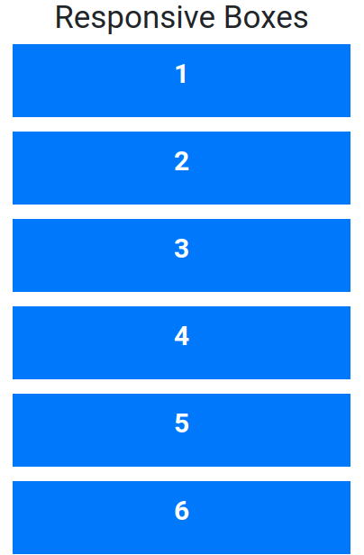
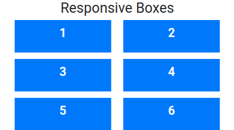
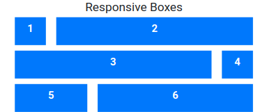
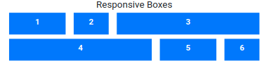
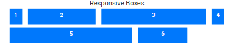

## Responsive Boxes

In this assignment, let's build a Responsive Color Palette.

**Refer to the below images.**

The following images illustrate all device sizes, from extra small to extra large.

- Extra Small (Size < 576px):

    - 

- Small (Size >= 576px):

    - 

- Medium (Size >= 768px):

    - 

- Large (Size >= 992px):

    - 

- Extra Large (Size >= 1200px):

    - 

