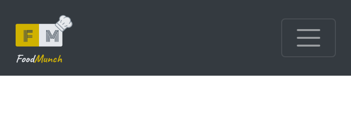
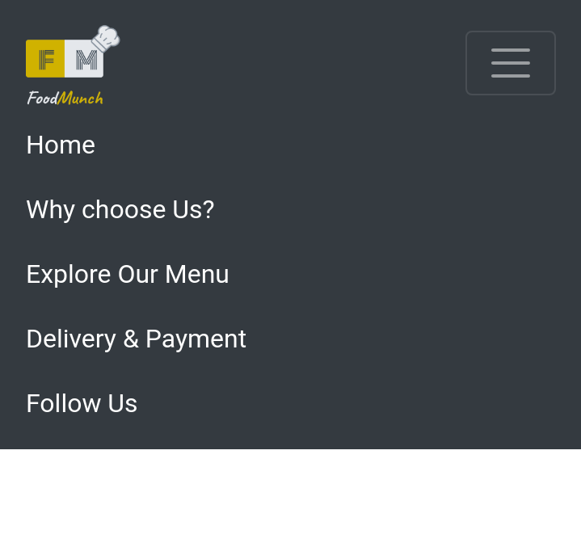
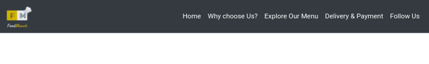

## Food Munch Navbar

In this assignment, let's build a Food Munch Navbar.

**Refer to the below images.**

The following images illustrate all device sizes, from extra small to extra large.

- Extra Small (Size < 576px), Small (Size >= 576px) and Medium (Size >= 768px):

    - 
    - 

- Large (Size >= 992px) and Extra Large (Size >= 1200px):

    - 

**Resources**
- Use the image given below.
    - Food Munch Logo URL: https://d1tgh8fmlzexmh.cloudfront.net/ccbp-responsive-website/food-munch-logo-img.png

