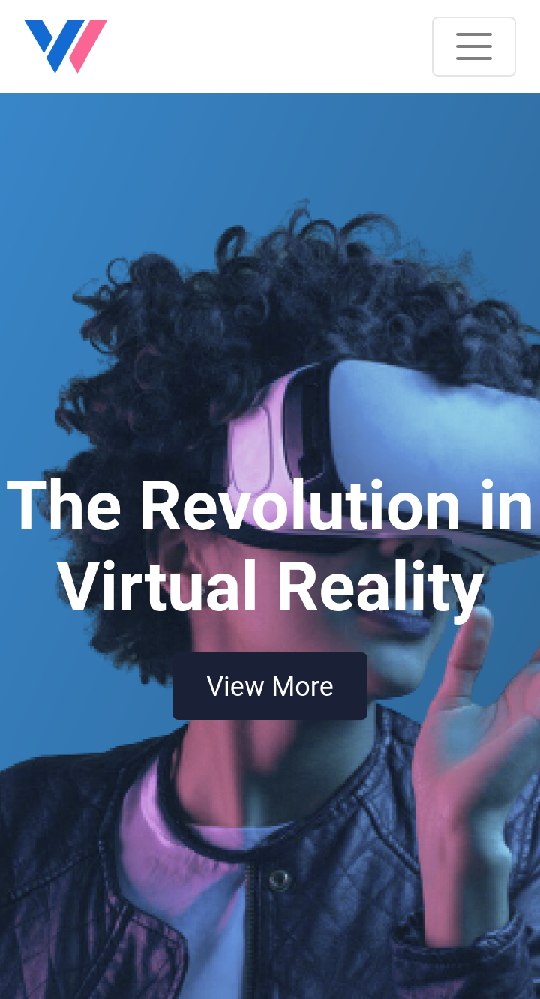
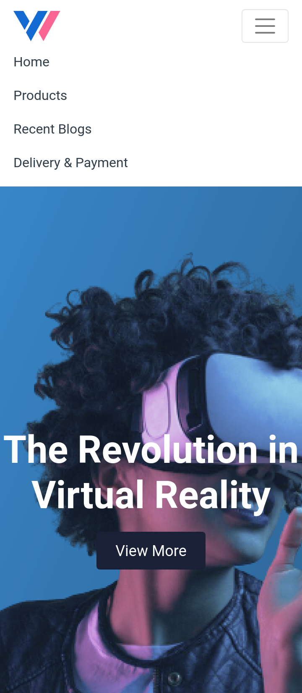
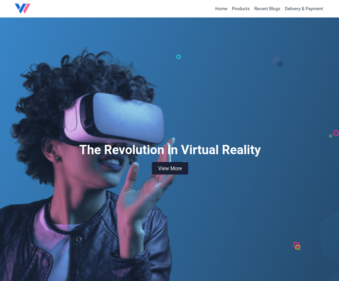

## VR Website Navbar & Banner Section

In this assignment, let's build a VR Website Navbar & Banner Section.

**Refer to the below images.**

The following images illustrate all device sizes, from extra small to extra large.

- Extra Small (Size < 576px), Small (Size >= 576px) and Medium (Size >= 768px):
    - 
    - 

- Large (Size >= 992px) and Extra Large (Size >= 1200px):
    - 

**Resources**
Use the image URLs given below.

- VR Logo: https://d1tgh8fmlzexmh.cloudfront.net/ccbp-responsive-website/vr-logo-img.png

- Background Image: https://d1tgh8fmlzexmh.cloudfront.net/ccbp-responsive-website/vr-banner-bg.png

**CSS Colors used:**
- `#323f4b`
- `#1a2137`
