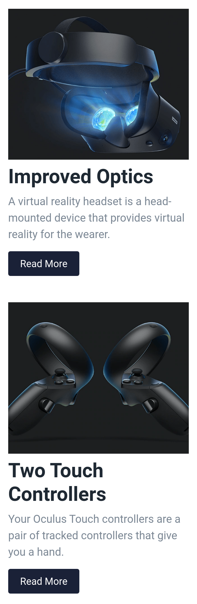
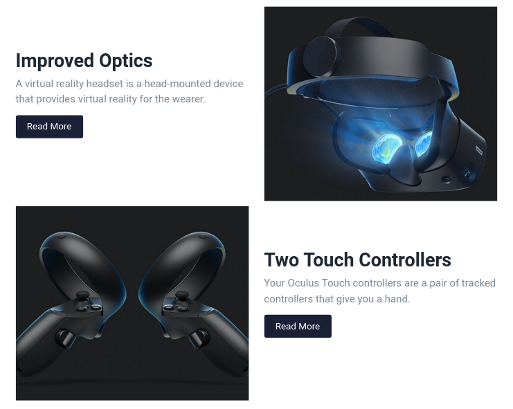

## VR Website Optics and Controllers Section

In this assignment, let's build a VR Website Optics and Controllers Section.

**Refer to the below images.**

The following images illustrate all device sizes, from extra small to extra large.

- Extra Small (Size < 576px), Small (Size >= 576px) :
    - 
    - 

- Medium (Size >= 768px), Large (Size >= 992px) and Extra Large (Size >= 1200px):
    - 

**Resources**
Use the image URLs given below.
- https://d1tgh8fmlzexmh.cloudfront.net/ccbp-responsive-website/vr-optics-img.png
- https://d1tgh8fmlzexmh.cloudfront.net/ccbp-responsive-website/vr-controllers-img.png

**CSS Colors used:**
- `#1f2933`
- `#7b8794`
-  `#1a2137`