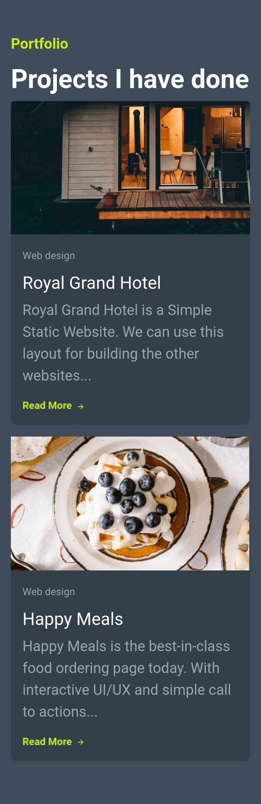
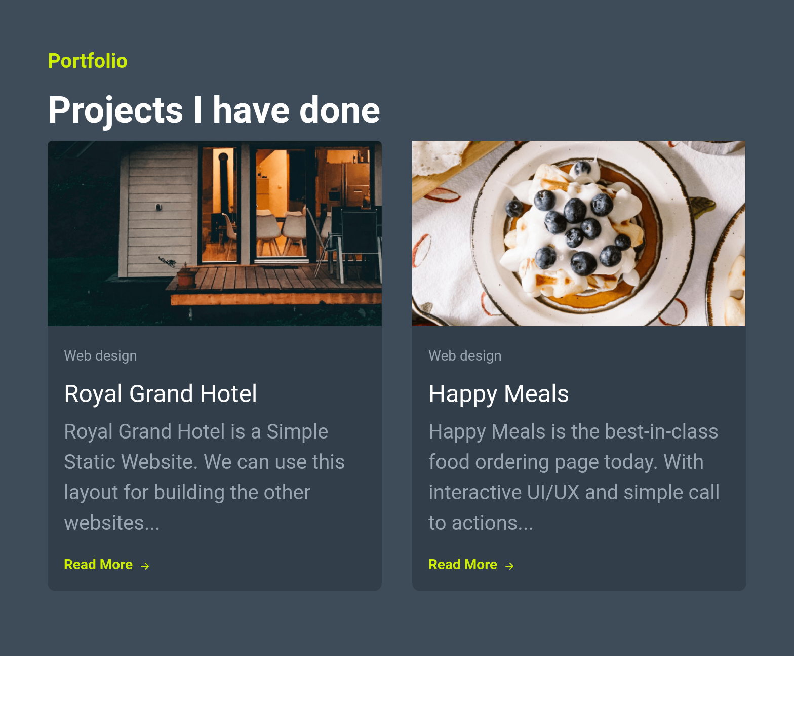

## Portfolio Website Projects Section

In this assignment, let's build a Portfolio Website Projects Section
.

**Refer to the below images.**

The following images illustrate all device sizes, from extra small to extra large.

- Extra Small (Size < 576px), Small (Size >= 576px) :
    - 

- Medium (Size >= 768px) and  Large (Size >= 992px) and Extra Large (Size >= 1200px):
    - 

**Resources**
Use the image URLs given below.
- https://d1tgh8fmlzexmh.cloudfront.net/ccbp-responsive-website/portfolio-project-1-img.png
- https://d1tgh8fmlzexmh.cloudfront.net/ccbp-responsive-website/portfolio-project-2-img.png

**CSS Colors used:**
- `#cced00`
- `#3e4c59`
- `#9aa5b1`
- `#323f4b`