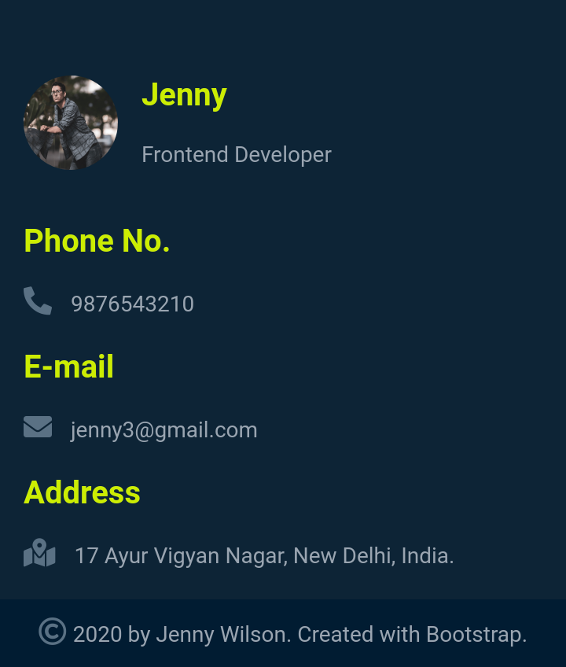
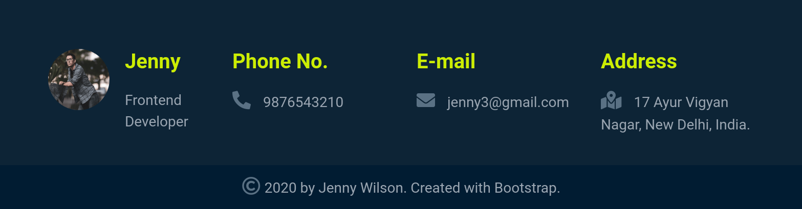

## Portfolio Website Footer Section

In this assignment, let's build a Portfolio Website Footer Section
.

**Refer to the below images.**

The following images illustrate all device sizes, from extra small to extra large.

- Extra Small (Size < 576px) and Small (Size >= 576px):

    - 

- Medium (Size >= 768px), Large (Size >= 992px) and Extra Large (Size >= 1200px):

    - 

**Resources**
Use the image URLs given below.
- https://d1tgh8fmlzexmh.cloudfront.net/ccbp-responsive-website/portfolio-work-done-bg.png

**CSS Colors used:**
- `#001c32`
- `#cced00`
- `#0d2436`
- `#9aa5b1`
- `#5a7184`