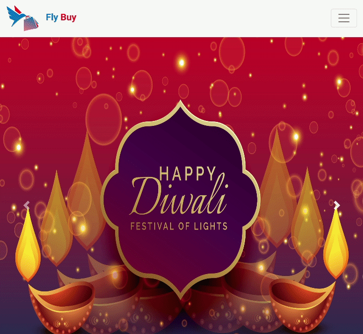

## Ecommerce Website Navbar & Banner Section

In this assignment, let's build a Ecommerce Website Navbar & Banner Section.

**Refer to the below images.**

The following images illustrate all device sizes, from extra small to extra large.

- Extra Small (Size < 576px) and Small (Size >= 576px):

    - 

- Medium (Size >= 768px):

    - 

- Large (Size >= 992px) and Extra Large (Size >= 1200px):

    - 

**Resources**
- Ecommerce Logo:

    - https://d1tgh8fmlzexmh.cloudfront.net/ccbp-responsive-website/ecommerce-website-logo-img.png

- For Extra Small and Small devices:

    - https://d1tgh8fmlzexmh.cloudfront.net/ccbp-responsive-website/ecommerce-carousel-1-sm-img.png
    - https://d1tgh8fmlzexmh.cloudfront.net/ccbp-responsive-website/ecommerce-carousel-2-sm-img.png
    - https://d1tgh8fmlzexmh.cloudfront.net/ccbp-responsive-website/ecommerce-carousel-3-sm-img.png

- For Medium, Large, and Extra Large devices:

    - https://d1tgh8fmlzexmh.cloudfront.net/ccbp-responsive-website/ecommerce-carousel-1-img.png
    - https://d1tgh8fmlzexmh.cloudfront.net/ccbp-responsive-website/ecommerce-carousel-2-img.png
    - https://d1tgh8fmlzexmh.cloudfront.net/ccbp-responsive-website/ecommerce-carousel-3-img.png

