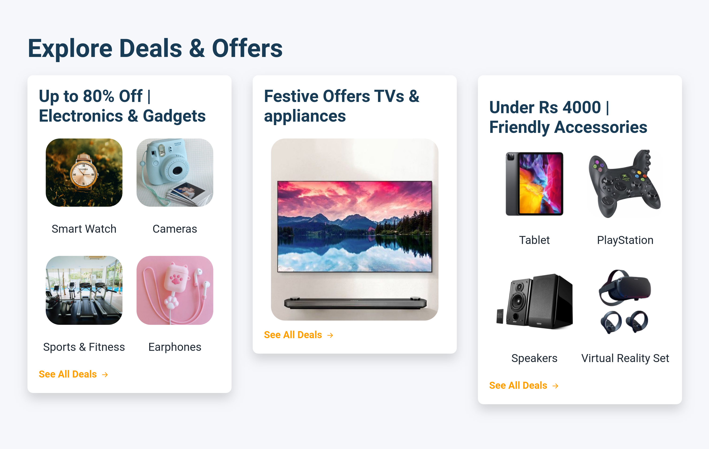

## Ecommerce Website Explore Section

In this assignment, let's build a Ecommerce Website Explore Section

**Refer to the below images.**

The following images illustrate all device sizes, from extra small to extra large.

- Extra Small (Size < 576px) and Small (Size >= 576px):

    - 

- Medium (Size >= 768px):

    - 

- Large (Size >= 992px) and Extra Large (Size >= 1200px):
    - 

**Resources**

Use the image URLs given below.

- https://d1tgh8fmlzexmh.cloudfront.net/ccbp-responsive-website/ecommerce-explore-mamba-watch-img.png
- https://d1tgh8fmlzexmh.cloudfront.net/ccbp-responsive-website/ecommerce-explore-camera-img.png
- https://d1tgh8fmlzexmh.cloudfront.net/ccbp-responsive-website/ecommerce-explore-sport-and-fitness-img.png
- https://d1tgh8fmlzexmh.cloudfront.net/ccbp-responsive-website/ecommerce-explore-ear-phones-pink-img.png
- https://d1tgh8fmlzexmh.cloudfront.net/ccbp-responsive-website/ecommerce-explore-tv-img.png
- https://d1tgh8fmlzexmh.cloudfront.net/ccbp-responsive-website/ecommerce-explore-tablet-device-img.png
- https://d1tgh8fmlzexmh.cloudfront.net/ccbp-responsive-website/ecommerce-explore-joy-stick-img.png
- https://d1tgh8fmlzexmh.cloudfront.net/ccbp-responsive-website/ecommerce-explore-speakers-big-img.png
- https://d1tgh8fmlzexmh.cloudfront.net/ccbp-responsive-website/ecommerce-explore-vr-set-img.png

**CSS Colors used:**

- `#f5f7fa`
- `#183b56`
- `#1f2933`
- `#ff9f00`