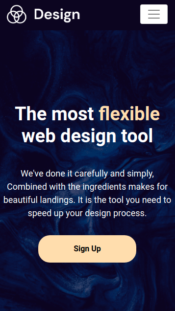
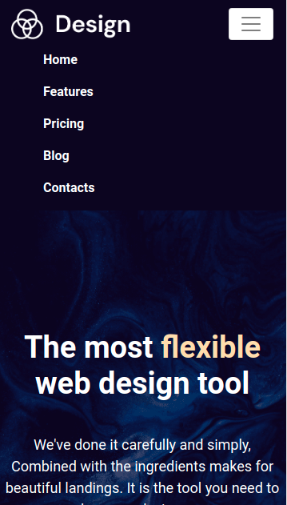
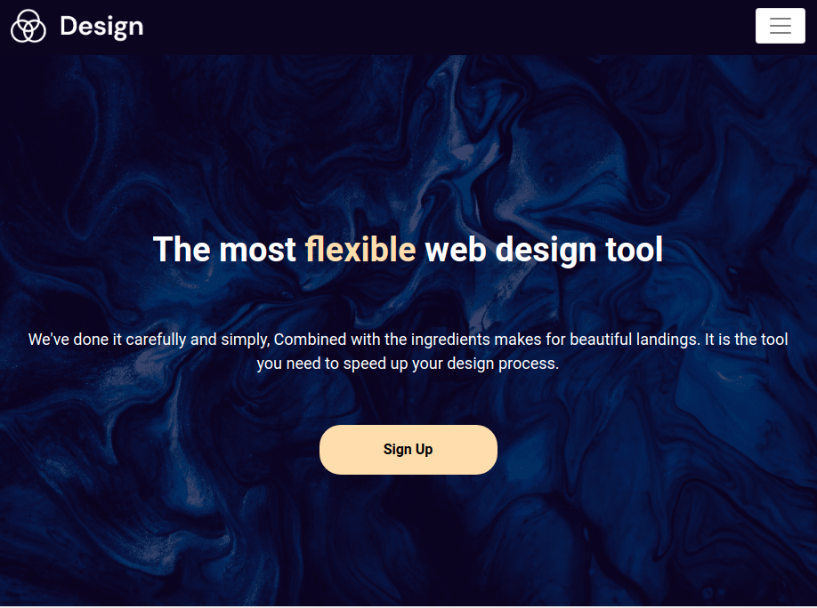
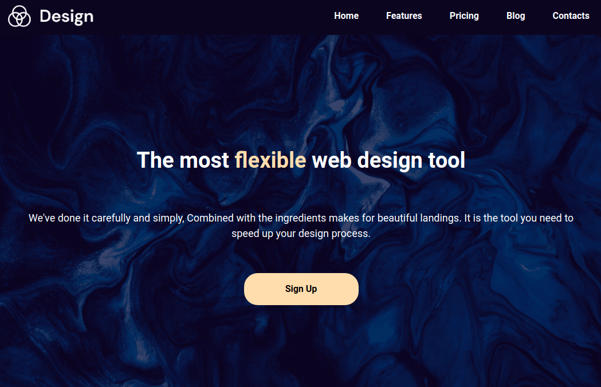

## Navbar & Banner Section

In this assignment, let's build a Navbar & Banner Section

**Refer to the below images.**

The following images illustrate all device sizes, from extra small to extra large.

- Extra Small (Size < 576px) and Small (Size >= 576px):

    - 
    - 

- Medium (Size >= 768px):

    - 

- Large (Size >= 992px) and Extra Large (Size >= 1200px):
    - 

**Resources**

Use the image URL given below.

- Design Tool Logo:

    - https://assets.ccbp.in/frontend/responsive-website/landing-section-design-logo-img.png

- Background Image:

    - https://assets.ccbp.in/frontend/responsive-website/landing-section-bg.png

**CSS Colors used:**

- `#0C0521`
- `#FFDDA9`