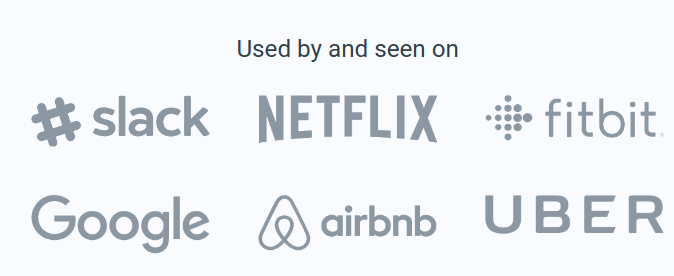
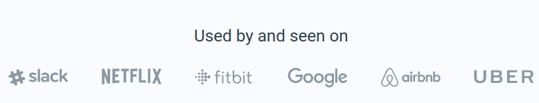

## Logos Section

In this assignment, let's build a Logos Section

**Refer to the below images.**

The following images illustrate all device sizes, from extra small to extra large.

- Extra Small (Size < 576px) and Small (Size >= 576px) and Medium (Size >= 768px):

    - 

- Large (Size >= 992px) and Extra Large (Size >= 1200px):
    - 

**Resources**

Use the image URL given below.

- https://assets.ccbp.in/frontend/responsive-website/used-seen-slack-img.png
- https://assets.ccbp.in/frontend/responsive-website/used-seen-netflix-img.png
- https://assets.ccbp.in/frontend/responsive-website/used-seen-fitbit-img.png
- https://assets.ccbp.in/frontend/responsive-website/used-seen-google-img.png
- https://assets.ccbp.in/frontend/responsive-website/used-seen-airbnb-img.png
- https://assets.ccbp.in/frontend/responsive-website/used-seen-uber-img.png

**CSS Colors used:**
- `#323f4b`

**CSS Font families used:**
- Roboto