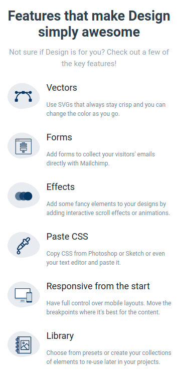
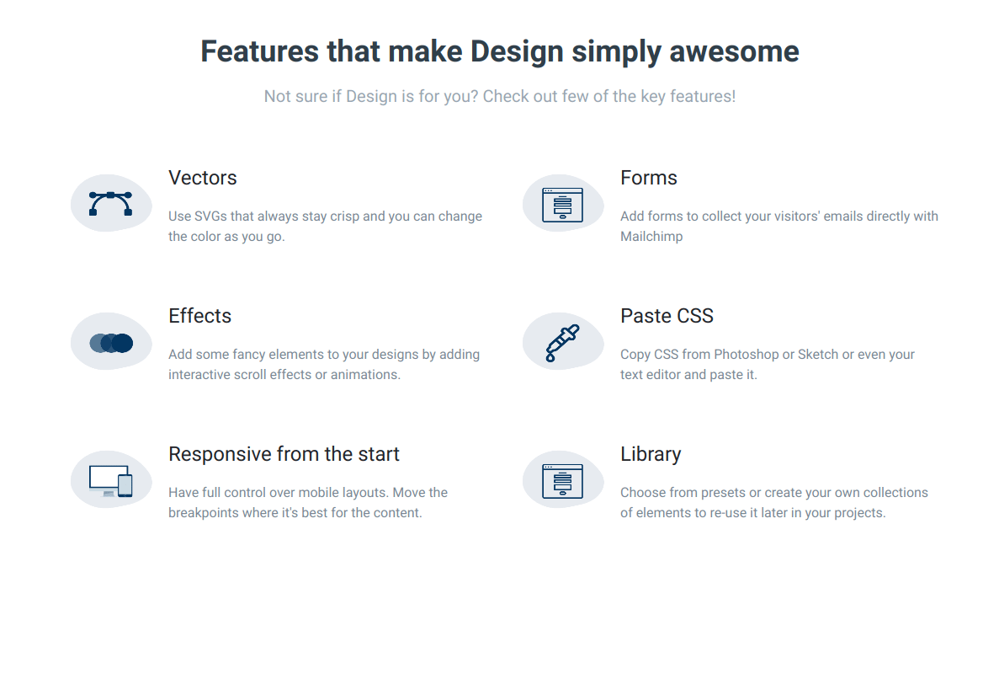

## Features Section

In this assignment, let's build a Features Section

**Refer to the below images.**

The following images illustrate all device sizes, from extra small to extra large.

- Extra Small (Size < 576px) and Small (Size >= 576px):

    - 

- Medium (Size >= 768px), Large (Size >= 992px) and Extra Large (Size >= 1200px):
    - 

**Resources**

Use the image URL given below.

- https://assets.ccbp.in/frontend/responsive-website/awsome-features-1-img.png
- https://assets.ccbp.in/frontend/responsive-website/awsome-features-2-img.png
- https://assets.ccbp.in/frontend/responsive-website/awsome-features-3-img.png
- https://assets.ccbp.in/frontend/responsive-website/awsome-features-4-img.png
- https://assets.ccbp.in/frontend/responsive-website/awsome-features-5-img.png
- https://assets.ccbp.in/frontend/responsive-website/awsome-features-6-img.png

**CSS Colors used:**

- Text color Hex Code values:

- `#323f4b`
- `#7b8794`
- `#9aa5b1`

**CSS Font families used:**
- Roboto